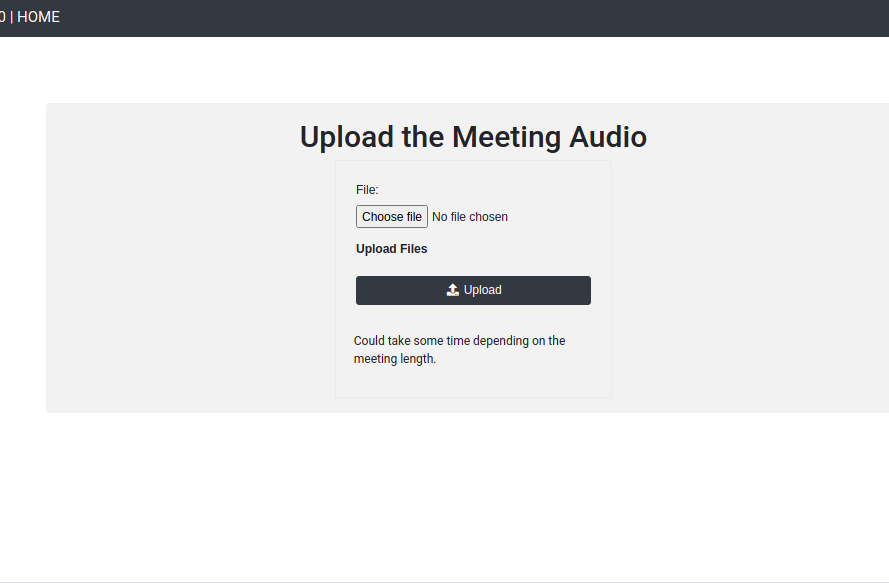
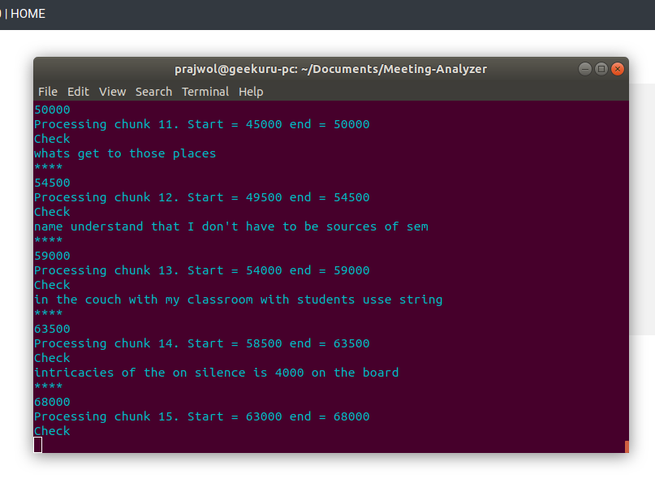
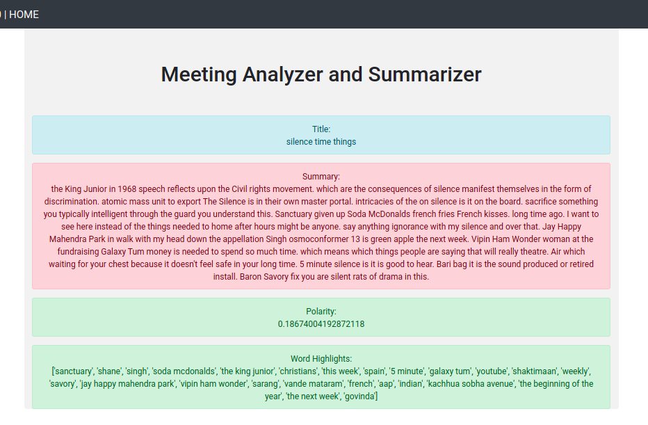

# Meeting-Analyzer

<h2>Steps</h2>
<li>git clone https://github.com/prajwollamichhane11/Meeting-Analyzer.git </li>
<li>pip install django==2.0.8</li>
<li>cd Meeting-Analyzer</li>
<li>python manage.py runserver</li>
<li>Install any libraries which you do not have on your PC and runserver</li>

<h2>TODO</h2>
<li>Create a bot</li>
<li>Record Live Meetings</li>

<h2>Snapshots</h2>
<h4>Upload</h4>
</img>
<h4>Process</h4>
</img>
<h4>Output</h4>
</img>

